This respository contains my solutions for [Advent of Code 2025](https://adventofcode.com/2025).
The beautiful tiles were generated with [this wonderful AoCTiles Script](https://github.com/LiquidFun/aoc_tiles), for which I am very grateful :)

<!-- AOC TILES BEGIN -->
<h1 align="center">
  2025 - 24 ⭐ - C++
</h1>
<a href="01/02.cpp">
  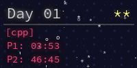
</a>

<a href="03/02.cpp">
  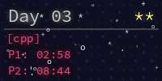
</a>
<a href="04/02.cpp">
  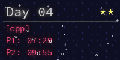
</a>
<a href="05/02.cpp">
  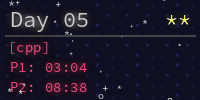
</a>
<a href="06/02.cpp">
  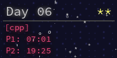
</a>
<a href="07/02.cpp">
  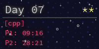
</a>
<a href="08/02.cpp">
  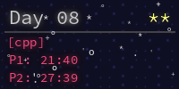
</a>
<a href="09/02.cpp">
  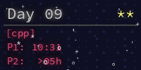
</a>
<a href="10/02.cpp">
  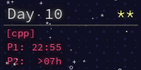
</a>
<a href="11/02.cpp">
  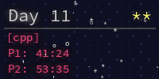
</a>
<a href="12/01.cpp">
  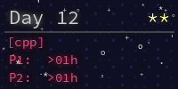
</a>
<!-- AOC TILES END -->
